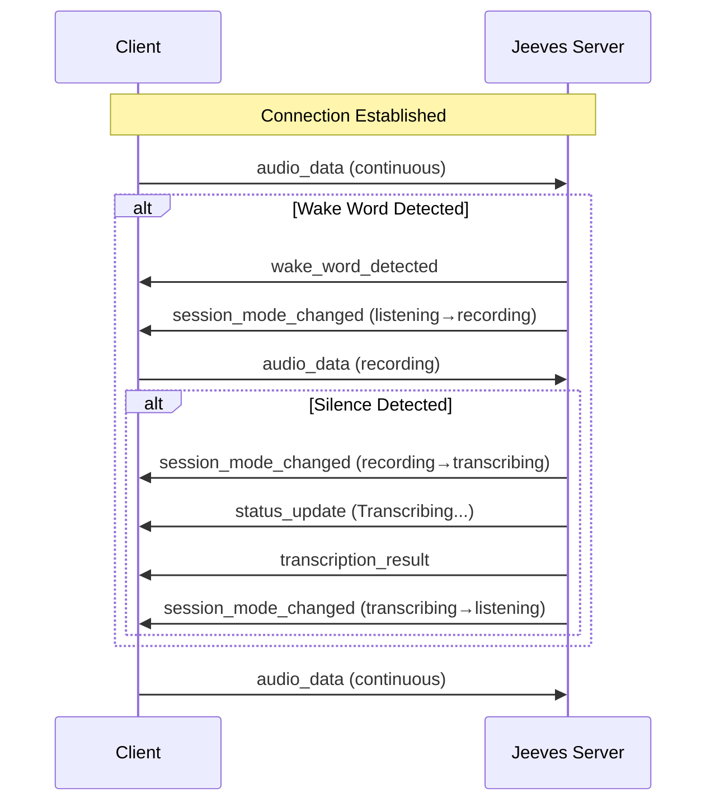
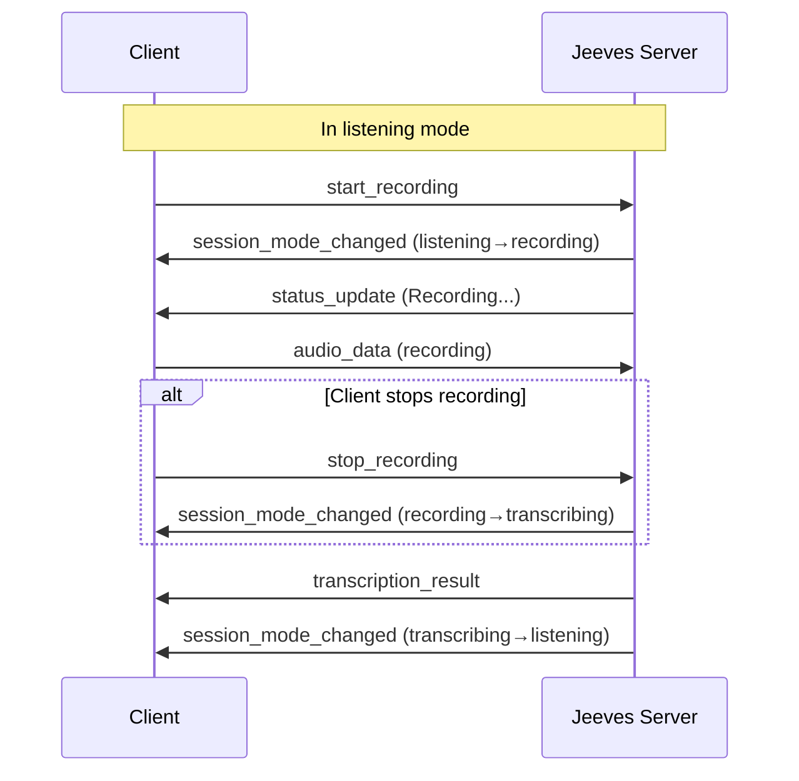
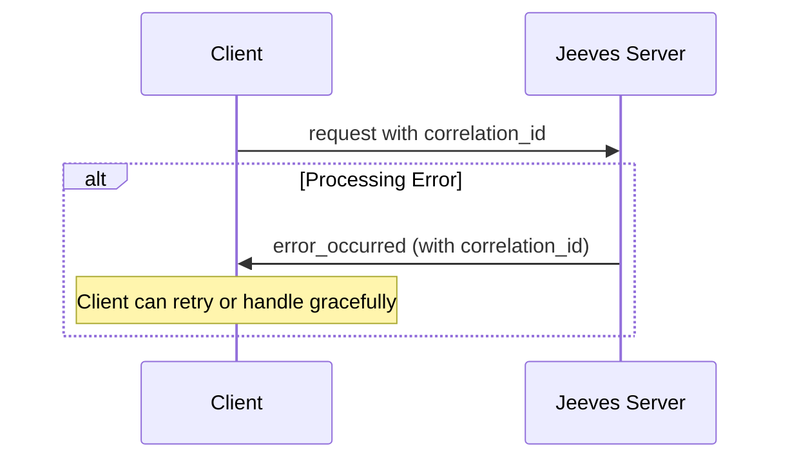

# Jeeves WebSocket Protocol Design Document

## 1. Overview

This document defines the WebSocket protocol for real-time communication between Jeeves server and clients. The protocol uses JSON for all messages and provides a structured, extensible framework for message routing and processing.

## 2. Message Envelope Structure

All messages use a common envelope structure that ensures consistent handling, debugging, and routing.

### 2.1 Envelope Schema

```json
{
  "$schema": "http://json-schema.org/draft-07/schema#",
  "type": "object",
  "required": ["message_id", "type", "timestamp"],
  "properties": {
    "message_id": {
      "type": "string",
      "format": "uuid",
      "description": "Unique identifier for this message. Used for correlation and debugging."
    },
    "type": {
      "type": "string",
      "description": "Message type identifier. See Section 3 for enumeration."
    },
    "timestamp": {
      "type": "string",
      "format": "date-time",
      "description": "ISO 8601 timestamp in UTC when the message was created."
    },
    "direction": {
      "type": "string",
      "enum": ["server_to_client", "client_to_server"],
      "description": "Indicates message direction. Set by sender, used for validation."
    },
    "payload": {
      "type": "object",
      "description": "Message-type-specific data payload."
    },
    "metadata": {
      "type": "object",
      "description": "Optional additional metadata for debugging/tracing."
    },
    "correlation_id": {
      "type": "string",
      "format": "uuid",
      "description": "Optional. References the message_id this message responds to."
    }
  }
}
```

### 2.2 Common Fields Description

| Field | Type | Required | Description |
|-------|------|----------|-------------|
| `message_id` | UUID | Yes | Unique identifier for every message. Generated by sender. |
| `type` | String | Yes | Message type identifier (enumerated in Section 3). |
| `timestamp` | ISO 8601 | Yes | UTC timestamp of message creation. |
| `direction` | Enum | Yes | `server_to_client` or `client_to_server`. |
| `payload` | Object | No | Message-type-specific data. |
| `metadata` | Object | No | Additional context (client info, trace IDs, etc.). |
| `correlation_id` | UUID | No | Links response to original request. |

### 2.3 Envelope Example

```json
{
  "message_id": "550e8400-e29b-41d4-a716-446655440000",
  "type": "wake_word_detected",
  "timestamp": "2025-12-30T10:58:25.000Z",
  "direction": "server_to_client",
  "payload": {
    "wake_word": "alexa",
    "confidence": 0.87,
    "audio_timestamp": "2025-12-30T10:58:24.950Z"
  },
  "metadata": {
    "server_version": "1.2.0",
    "session_id": "sess_abc123"
  }
}
```

## 3. Message Type Identification System

Message types are identified by a string identifier in the `type` field. Types follow a naming convention using snake_case for consistency.

### 3.1 Type Naming Convention

- **Server→Client events**: `{action}_detected`, `{state}_started`, `{state}_completed`
- **Server→Client responses**: `{operation}_result`, `{operation}_error`
- **Client→Server commands**: `{verb}_{noun}` (e.g., `start_recording`, `get_status`)
- **Client→Server queries**: `get_{noun}` (e.g., `get_config`)

### 3.2 Message Type Enumeration

#### Server→Client Message Types

| Type | Direction | Category | Description |
|------|-----------|----------|-------------|
| `wake_word_detected` | S→C | Event | Wake word detected, entering streaming mode |
| `session_mode_changed` | S→C | State | Server mode changed (listening, recording, etc.) |
| `status_update` | S→C | Status | General status updates |
| `config_payload` | S→C | Config | Server sends configuration to client |
| `transcription_result` | S→C | Result | Transcription of recorded audio |
| `audio_stream_started` | S→C | Event | Client audio stream connected |
| `audio_stream_stopped` | S→C | Event | Client audio stream disconnected |
| `error_occurred` | S→C | Error | Error occurred during processing |
| `heartbeat` | S→C | System | Keep-alive ping from server |

#### Client→Server Message Types

| Type | Direction | Category | Description |
|------|-----------|----------|-------------|
| `start_recording` | C→S | Command | Manually start recording audio |
| `stop_recording` | C→S | Command | Manually stop recording audio |
| `send_config` | C→S | Config | Client sends configuration to server |
| `request_config` | C→S | Query | Client requests server configuration |
| `request_status` | C→S | Query | Client requests current server status |
| `reset_session` | C→S | Command | Reset the current session state |
| `audio_data` | C→S | Data | Raw audio data chunks |
| `ping` | C→S | System | Client keep-alive ping |
| `subscribe` | C→S | Command | Subscribe to specific event types |
| `unsubscribe` | C→S | Command | Unsubscribe from event types |

## 4. Server→Client Message Schemas

### 4.1 Wake Word Detected

**Type**: `wake_word_detected`

**Description**: Signal that wake word was detected, entering streaming mode.

```json
{
  "type": "object",
  "required": ["wake_word", "confidence"],
  "properties": {
    "wake_word": {
      "type": "string",
      "description": "The detected wake word (e.g., 'alexa', 'hey_siri')."
    },
    "confidence": {
      "type": "number",
      "minimum": 0,
      "maximum": 1,
      "description": "Confidence score of the detection (0-1)."
    },
    "audio_timestamp": {
      "type": "string",
      "format": "date-time",
      "description": "Timestamp when the wake word was detected in the audio stream."
    },
    "threshold_used": {
      "type": "number",
      "description": "The detection threshold that was applied."
    },
    "model_info": {
      "type": "object",
      "description": "Information about the wake word model used."
    }
  }
}
```

### 4.2 Session Mode Changed

**Type**: `session_mode_changed`

**Description**: Notify when server changes modes.

```json
{
  "type": "object",
  "required": ["previous_mode", "current_mode"],
  "properties": {
    "previous_mode": {
      "type": "string",
      "enum": ["idle", "listening", "recording", "transcribing", "streaming"],
      "description": "The mode the server was in before this change."
    },
    "current_mode": {
      "type": "string",
      "enum": ["idle", "listening", "recording", "transcribing", "streaming"],
      "description": "The new mode the server is now in."
    },
    "reason": {
      "type": "string",
      "description": "Optional human-readable reason for the mode change."
    },
    "mode_data": {
      "type": "object",
      "description": "Optional additional data specific to the new mode."
    }
  }
}
```

**Mode Definitions**:

| Mode | Description |
|------|-------------|
| `idle` | Server is initialized but no client connected |
| `listening` | Server is listening for wake word |
| `recording` | Server is actively recording audio |
| `transcribing` | Server is transcribing recorded audio |
| `streaming` | Real-time audio streaming is active |

### 4.3 Status Update

**Type**: `status_update`

**Description**: General status updates from the server.

```json
{
  "type": "object",
  "required": ["message", "level"],
  "properties": {
    "message": {
      "type": "string",
      "description": "Human-readable status message."
    },
    "level": {
      "type": "string",
      "enum": ["debug", "info", "warning", "error", "critical"],
      "description": "Severity level of the status update."
    },
    "code": {
      "type": "string",
      "description": "Optional machine-readable status code."
    },
    "progress": {
      "type": "number",
      "minimum": 0,
      "maximum": 1,
      "description": "Optional progress indicator (0-1) for long-running operations."
    },
    "details": {
      "type": "object",
      "description": "Additional details about the status."
    }
  }
}
```

### 4.4 Config Payload

**Type**: `config_payload`

**Description**: Server sends configuration blocks to the client.

```json
{
  "type": "object",
  "required": ["config_type", "config_data"],
  "properties": {
    "config_type": {
      "type": "string",
      "enum": ["audio", "wake_word", "transcription", "general", "full"],
      "description": "Type of configuration being sent."
    },
    "config_data": {
      "type": "object",
      "description": "Configuration data block."
    },
    "version": {
      "type": "string",
      "description": "Configuration version for caching/invalidation."
    },
    "schema_version": {
      "type": "string",
      "description": "Version of the configuration schema."
    }
  }
}
```

### 4.5 Transcription Result

**Type**: `transcription_result`

**Description**: Result of audio transcription.

```json
{
  "type": "object",
  "required": ["text", "language"],
  "properties": {
    "text": {
      "type": "string",
      "description": "The transcribed text."
    },
    "language": {
      "type": "string",
      "description": "Detected or specified language code (e.g., 'en')."
    },
    "confidence": {
      "type": "number",
      "minimum": 0,
      "maximum": 1,
      "description": "Confidence score of the transcription."
    },
    "duration": {
      "type": "number",
      "description": "Duration of the audio that was transcribed (seconds)."
    },
    "processing_time": {
      "type": "number",
      "description": "Time taken to process the transcription (seconds)."
    },
    "segments": {
      "type": "array",
      "description": "Optional detailed segment information."
    },
    "session_id": {
      "type": "string",
      "description": "Session ID this transcription belongs to."
    }
  }
}
```

### 4.6 Error Occurred

**Type**: `error_occurred`

**Description**: Error occurred during processing.

```json
{
  "type": "object",
  "required": ["error_code", "message"],
  "properties": {
    "error_code": {
      "type": "string",
      "description": "Machine-readable error code."
    },
    "message": {
      "type": "string",
      "description": "Human-readable error message."
    },
    "severity": {
      "type": "string",
      "enum": ["minor", "major", "critical"],
      "description": "Severity of the error."
    },
    "details": {
      "type": "object",
      "description": "Additional error details."
    },
    "recoverable": {
      "type": "boolean",
      "description": "Whether the error is recoverable."
    },
    "recovery_action": {
      "type": "string",
      "description": "Recommended action to recover from the error."
    }
  }
}
```

**Standard Error Codes**:

| Code | Description |
|------|-------------|
| `AUDIO_BUFFER_OVERFLOW` | Audio buffer exceeded maximum size |
| `TRANSCRIPTION_FAILED` | Transcription process failed |
| `WAKE_WORD_MODEL_ERROR` | Wake word detection model error |
| `SESSION_TIMEOUT` | Session timed out |
| `INVALID_AUDIO_FORMAT` | Received audio format not supported |
| `RATE_LIMIT_EXCEEDED` | Message rate limit exceeded |
| `UNAUTHORIZED` | Client not authorized |

## 5. Client→Server Message Patterns

### 5.1 Audio Data

**Type**: `audio_data`

**Description**: Raw audio data chunks from client to server.

```json
{
  "type": "object",
  "required": ["format", "sample_rate", "channels", "data"],
  "properties": {
    "format": {
      "type": "string",
      "enum": ["int16", "int32", "float32"],
      "description": "Audio sample format."
    },
    "sample_rate": {
      "type": "integer",
      "description": "Sample rate in Hz (typically 16000)."
    },
    "channels": {
      "type": "integer",
      "description": "Number of audio channels (typically 1 for mono)."
    },
    "data": {
      "type": "string",
      "format": "base64",
      "description": "Base64-encoded audio data."
    },
    "chunk_index": {
      "type": "integer",
      "description": "Index of this audio chunk for ordering."
    },
    "timestamp": {
      "type": "string",
      "format": "date-time",
      "description": "Client-side timestamp when audio was captured."
    }
  }
}
```

**Note**: For high-performance scenarios, raw binary audio can be sent as WebSocket binary frames instead of JSON. The protocol should support both.

### 5.2 Commands

**Type**: `start_recording`, `stop_recording`, `reset_session`

**Description**: Commands to control server behavior.

```json
{
  "type": "object",
  "properties": {
    "command": {
      "type": "string",
      "description": "The command being issued."
    },
    "parameters": {
      "type": "object",
      "description": "Command-specific parameters."
    }
  }
}
```

**Example: Start Recording with Parameters**

```json
{
  "message_id": "msg_001",
  "type": "start_recording",
  "timestamp": "2025-12-30T10:58:25.000Z",
  "direction": "client_to_server",
  "payload": {
    "command": "start_recording",
    "parameters": {
      "max_duration": 15.0,
      "vad_enabled": true,
      "silence_threshold": 0.01
    }
  }
}
```

### 5.3 Queries

**Type**: `request_config`, `request_status`

**Description**: Client requests information from server.

```json
{
  "type": "object",
  "properties": {
    "query_type": {
      "type": "string",
      "description": "Type of information requested."
    },
    "filters": {
      "type": "object",
      "description": "Optional filters to apply."
    }
  }
}
```

**Example: Request Status**

```json
{
  "message_id": "msg_002",
  "type": "request_status",
  "timestamp": "2025-12-30T10:58:25.000Z",
  "direction": "client_to_server",
  "payload": {
    "query_type": "status",
    "filters": {
      "include_stats": true
    }
  }
}
```

### 5.4 Configuration

**Type**: `send_config`

**Description**: Client sends configuration to server.

```json
{
  "type": "object",
  "required": ["config_type", "config_data"],
  "properties": {
    "config_type": {
      "type": "string",
      "enum": ["audio", "wake_word", "transcription", "general"],
      "description": "Type of configuration being sent."
    },
    "config_data": {
      "type": "object",
      "description": "Configuration values to update."
    },
    "persist": {
      "type": "boolean",
      "description": "Whether to persist configuration to disk."
    }
  }
}
```

### 5.5 Subscriptions

**Type**: `subscribe`, `unsubscribe`

**Description**: Client manages event subscriptions.

```json
{
  "type": "object",
  "required": ["event_types"],
  "properties": {
    "event_types": {
      "type": "array",
      "items": {
        "type": "string"
      },
      "description": "List of event types to subscribe/unsubscribe from."
    },
    "all_events": {
      "type": "boolean",
      "description": "If true, subscribe to all event types."
    }
  }
}
```

## 6. Error Handling

### 6.1 Error Response Pattern

All error responses include:
- `correlation_id`: Links to the original request
- `error_occurred` type message with details

```json
{
  "message_id": "error_001",
  "type": "error_occurred",
  "timestamp": "2025-12-30T10:58:25.000Z",
  "direction": "server_to_client",
  "correlation_id": "original_message_id",
  "payload": {
    "error_code": "INVALID_AUDIO_FORMAT",
    "message": "Audio format 'mp3' is not supported. Use int16 PCM at 16000Hz.",
    "severity": "major",
    "recoverable": true,
    "recovery_action": "Send audio as 16-bit PCM, 16000Hz, mono."
  }
}
```

### 6.2 Validation Errors

Messages that fail schema validation return:

```json
{
  "message_id": "val_error_001",
  "type": "error_occurred",
  "timestamp": "2025-12-30T10:58:25.000Z",
  "direction": "server_to_client",
  "correlation_id": "original_message_id",
  "payload": {
    "error_code": "VALIDATION_FAILED",
    "message": "Message failed schema validation: missing required field 'type'",
    "severity": "minor",
    "details": {
      "validation_errors": [
        {
          "field": "type",
          "error": "required field missing"
        }
      ]
    },
    "recoverable": true
  }
}
```

## 7. Example Payloads

### 7.1 Complete Session Flow Example

```
Client → Server: Audio stream connected
Server → Client: Audio stream started
Client → Server: Audio data chunks
Server → Client: Wake word detected
Server → Client: Session mode changed (listening → recording)
Server → Client: Status update (Recording...)
Client → Server: Audio data chunks
Server → Client: Session mode changed (recording → transcribing)
Server → Client: Status update (Transcribing...)
Server → Client: Transcription result
Server → Client: Session mode changed (transcribing → listening)
Server → Client: Status update (Listening...)
```

### 7.2 Wake Word Detected Message

```json
{
  "message_id": "550e8400-e29b-41d4-a716-446655440000",
  "type": "wake_word_detected",
  "timestamp": "2025-12-30T10:58:24.950Z",
  "direction": "server_to_client",
  "payload": {
    "wake_word": "alexa",
    "confidence": 0.87,
    "audio_timestamp": "2025-12-30T10:58:24.945Z",
    "threshold_used": 0.5,
    "model_info": {
      "name": "openwakeword",
      "version": "0.1.0"
    }
  }
}
```

### 7.3 Session Mode Changed Message

```json
{
  "message_id": "550e8400-e29b-41d4-a716-446655440001",
  "type": "session_mode_changed",
  "timestamp": "2025-12-30T10:58:24.955Z",
  "direction": "server_to_client",
  "payload": {
    "previous_mode": "listening",
    "current_mode": "recording",
    "reason": "Wake word detected",
    "mode_data": {
      "recording_start_time": "2025-12-30T10:58:24.960Z",
      "buffer_size": 0
    }
  }
}
```

### 7.4 Status Update Message

```json
{
  "message_id": "550e8400-e29b-41d4-a716-446655440002",
  "type": "status_update",
  "timestamp": "2025-12-30T10:58:25.000Z",
  "direction": "server_to_client",
  "payload": {
    "message": "Transcribing audio segment...",
    "level": "info",
    "code": "TRANSCRIBING",
    "progress": 0.45,
    "details": {
      "segment_number": 2,
      "total_segments": 3
    }
  }
}
```

### 7.5 Config Payload Message

```json
{
  "message_id": "550e8400-e29b-41d4-a716-446655440003",
  "type": "config_payload",
  "timestamp": "2025-12-30T10:58:25.000Z",
  "direction": "server_to_client",
  "payload": {
    "config_type": "audio",
    "config_data": {
      "sample_rate": 16000,
      "channels": 1,
      "format": "int16",
      "chunk_size": 960
    },
    "version": "1.0.0",
    "schema_version": "1.0"
  }
}
```

### 7.6 Transcription Result Message

```json
{
  "message_id": "550e8400-e29b-41d4-a716-446655440004",
  "type": "transcription_result",
  "timestamp": "2025-12-30T10:58:30.000Z",
  "direction": "server_to_client",
  "payload": {
    "text": "Turn on the living room lights",
    "language": "en",
    "confidence": 0.94,
    "duration": 3.2,
    "processing_time": 0.85,
    "segments": [
      {
        "start": 0.0,
        "end": 0.5,
        "text": "Turn"
      },
      {
        "start": 0.5,
        "end": 1.2,
        "text": "on the"
      },
      {
        "start": 1.2,
        "end": 2.5,
        "text": "living room"
      },
      {
        "start": 2.5,
        "end": 3.2,
        "text": "lights"
      }
    ],
    "session_id": "sess_abc123"
  }
}
```

### 7.7 Client Start Recording Command

```json
{
  "message_id": "msg_client_001",
  "type": "start_recording",
  "timestamp": "2025-12-30T10:58:25.000Z",
  "direction": "client_to_server",
  "payload": {
    "command": "start_recording",
    "parameters": {
      "max_duration": 15.0,
      "vad_enabled": true,
      "silence_threshold": 0.01,
      "silence_timeout": 0.7
    }
  }
}
```

### 7.8 Client Send Config Message

```json
{
  "message_id": "msg_client_002",
  "type": "send_config",
  "timestamp": "2025-12-30T10:58:25.000Z",
  "direction": "client_to_server",
  "payload": {
    "config_type": "wake_word",
    "config_data": {
      "threshold": 0.6,
      "enabled_words": ["alexa", "hey_siri"],
      "custom_words": ["jarvis"]
    },
    "persist": true
  }
}
```

### 7.9 Heartbeat Messages

**Server → Client (Heartbeat)**:
```json
{
  "message_id": "hb_001",
  "type": "heartbeat",
  "timestamp": "2025-12-30T10:58:25.000Z",
  "direction": "server_to_client",
  "payload": {
    "server_time": "2025-12-30T10:58:25.000Z",
    "uptime_seconds": 3600
  }
}
```

**Client → Server (Ping)**:
```json
{
  "message_id": "ping_001",
  "type": "ping",
  "timestamp": "2025-12-30T10:58:25.000Z",
  "direction": "client_to_server",
  "payload": {
    "client_time": "2025-12-30T10:58:25.000Z"
  }
}
```

## 8. Protocol Flow Diagrams

### 8.1 Typical Wake Word Session Flow



### 8.2 Manual Recording Session



### 8.3 Error Handling Flow



## 9. Extensibility Guidelines

### 9.1 Adding New Message Types

1. Add the type string to the appropriate enumeration in Section 3
2. Define the payload schema following patterns in Section 4 or 5
3. Update documentation
4. Consider backward compatibility (clients should ignore unknown types)

### 9.2 Versioning

- `message_id`: UUID for unique identification
- `schema_version`: In config payloads for schema changes
- `version`: Configuration version for cache invalidation

### 9.3 Forward Compatibility

Clients should:
- Ignore unknown message types gracefully
- Log unknown types for debugging
- Continue processing known message types

## 10. Security Considerations

1. **Authentication**: Add `auth_token` field to envelope for authenticated sessions
2. **Rate Limiting**: Include `rate_limit` info in metadata
3. **Input Validation**: Validate all payloads server-side
4. **Base64 Safety**: Use URL-safe base64 for audio data
5. **Size Limits**: Enforce maximum message size (e.g., 1MB for audio chunks)

## 11. Implementation Notes

### 11.1 Binary Audio Handling

For performance, audio can be sent as binary WebSocket frames:
- Binary frame: Raw audio data (PCM 16-bit, 16000Hz, mono)
- JSON message: Control messages and metadata

### 11.2 Message Ordering

- All control messages are JSON
- Audio frames maintain order via WebSocket
- Correlation IDs link requests to responses

### 11.3 Connection Lifecycle

1. **Connect**: Client establishes WebSocket connection
2. **Hello**: Server sends `audio_stream_started` with config
3. **Session**: Normal operation with audio + control messages
4. **Disconnect**: Server sends `audio_stream_stopped`

---

**Document Version**: 1.0  
**Last Updated**: 2025-12-30  
**Protocol Version**: 1.0.0
